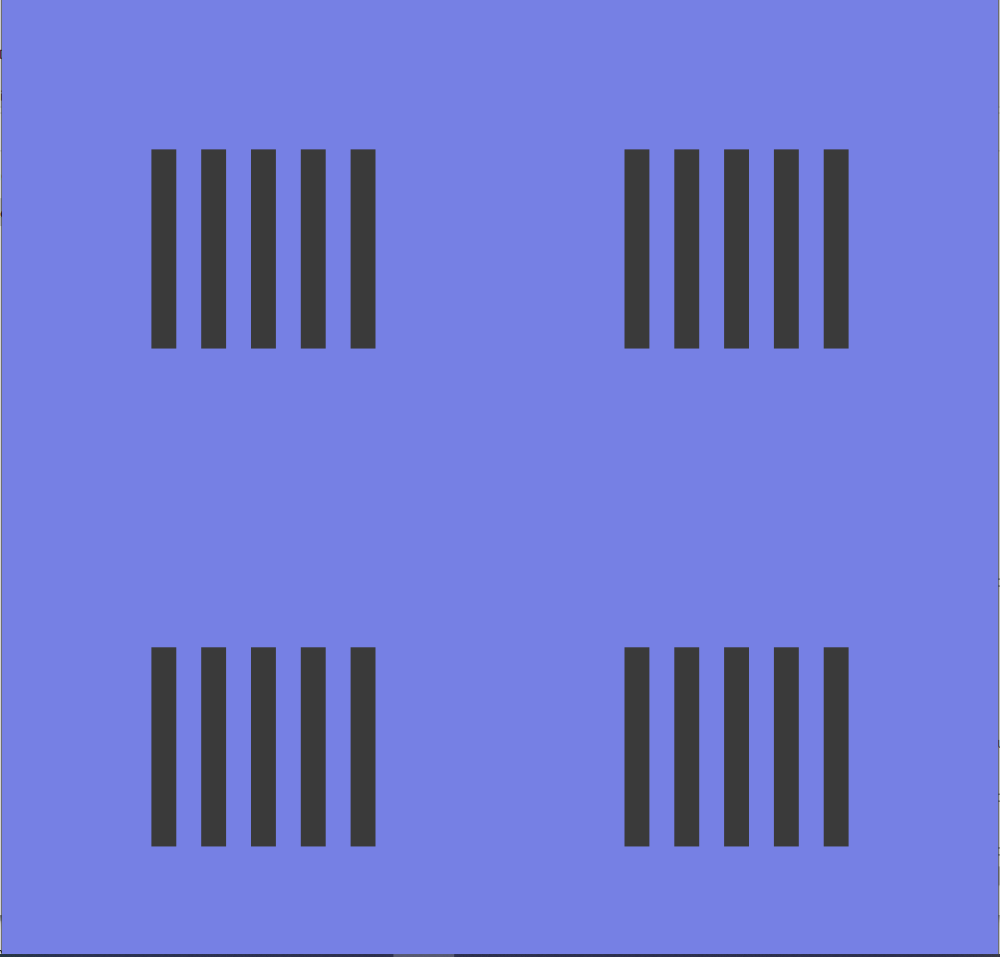

# Using Loop to Simplify Drawing Lots of Rectangles with Clear Pattern

## Description for students

In this exercise, you will first study the starter code that draws the rectangles as follows.

You will figure out the pattern of the locations of the rectangles and convert it into a loop based solution. 

## Description for instructors

- starter code: loop1-starter
- solution code: loop1-solution

