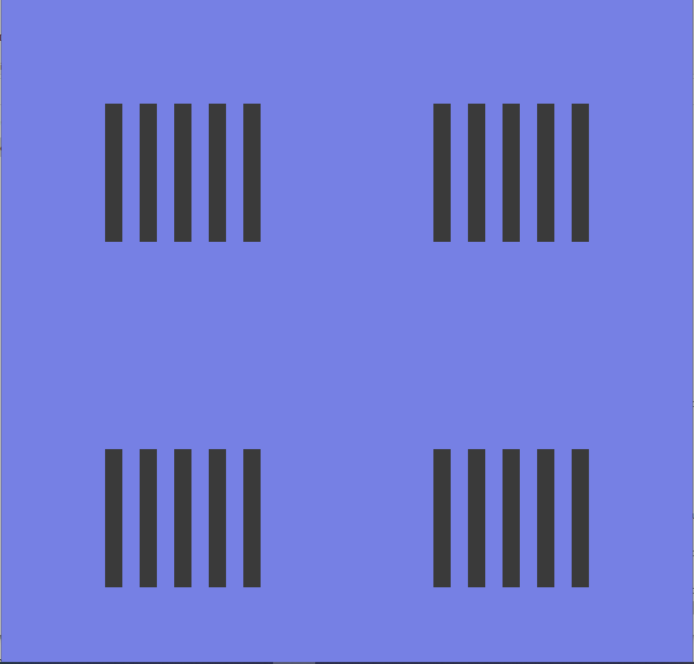

:pt_chapter: 4   

= Loops

== Learning Outcomes
Students will be able to:

. xxx 
. xxx

== Turotial Video

Will change to our own video: https://www.youtube.com/watch?v=Q04sKyZsUKo[How to download and install Processing Programming Language on Windows 10]

Please follow the video to download and install Processing. The starter code used can be downloaded using the link below.

== Starter Code 

link to zip file

=== Code Explanation

== Exercise 1: Using Loop to Simplify Drawing Lots of Rectangles with Clear Pattern

In this exercise, you will first study the starter code that draws the rectangles as follows.

image:images/StudenCourseTeacherUML.JPG[Student-Course-Teacher UML Diagram]

You will figure out the pattern of the locations of the rectangles and convert it into a loop based solution. 

=== Starter code
sourcecode/hoop-ex1-starter

=== Solution code
sourcecode/hoop-ex1-solution
sourcecode/hoop-ex1-solution2
sourcecode/hoop-ex1-solution3

== Exercise 2
Description here

=== Starter code

== Exercise 3
Description here

=== Starter code
